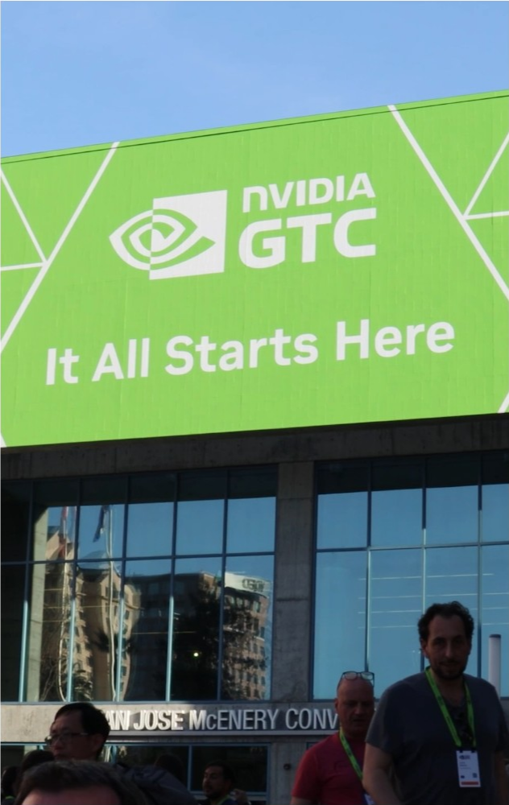
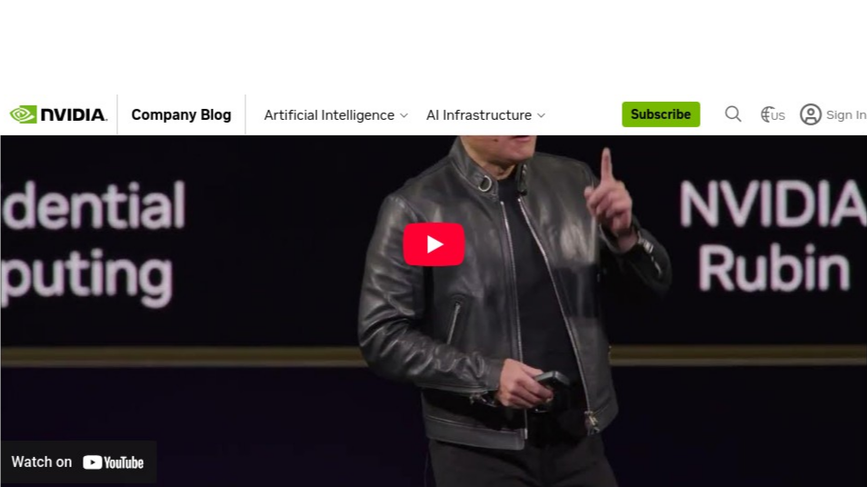
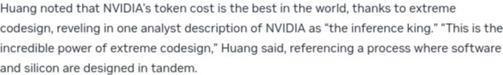

# 黄仁勋 GTC 2026 主题演讲深度解析：推理时代、万亿需求与物理 AI

**作者**: Damon Li  
**日期**: 2026年3月17日  
**来源**: NVIDIA GTC 2026 大会，美国加州圣何塞 SAP Center，北京时间2026年3月17日凌晨2:00

---

  
*图1: GTC 2026 大会会场——美国加州圣何塞 SAP Center，"It All Starts Here"*

---

## 摘要

2026年3月17日，英伟达（NVIDIA）创始人兼 CEO 黄仁勋在 GTC 2026 大会上发表了备受瞩目的主题演讲。本次演讲的核心信息可以概括为三大战略宣言：**推理时代的全面到来**、**万亿美元级别的 AI 计算需求**，以及 **AI 从数字世界向物理世界的全面进军**。黄仁勋不仅发布了下一代计算平台 **Vera Rubin** 和 **Feynman** 的详细路线图，更将公司的定位从"芯片公司"彻底转向"AI基础设施和工厂的构建者"，并提出了"Token 工厂经济学"和"Agent 终结 SaaS"等颠覆性商业理念。[1]

---

## 0. 开场：CUDA 二十年与"五层蛋糕"架构

黄仁勋以 CUDA 诞生二十周年为开场，将 CUDA 比作驱动英伟达飞轮的核心引擎。他随后提出了贯穿整个演讲的"五层蛋糕"架构，将 AI 产业的全景分为五个层级：

| 层级 | 内容 |
| :--- | :--- |
| **第一层** | 土地、电力与机房等基础设施 |
| **第二层** | 芯片（GPU、CPU、DPU、LPU） |
| **第三层** | 平台（CUDA-X、系统平台、AI工厂平台） |
| **第四层** | 模型（开源与闭源的各类 AI 模型） |
| **第五层** | 应用（推动整个行业腾飞的各类应用） |

黄仁勋还提出了 AI 发展的三大历史性突破：ChatGPT 开启生成式 AI 时代（2022-2023）、推理 AI（以 o1 为代表），以及 Claude Code 首个智能体模型。他指出，AI 已从"感知"进化到"生成"，再到"推理"，最终到达能够真正"完成工作"的 Agent 阶段。[2]

## 1. 核心发布：Vera Rubin 与 Feynman 平台

  
*图2: 黄仁勋在 GTC 2026 演讲现场，背景为 NVIDIA Rubin 平台*

### 1.1 Vera Rubin 平台：为推理而生

黄仁勋在演讲中正式揭开了 Vera Rubin 平台的神秘面纱，这是一个为“推理时代”量身打造的全栈计算系统。其核心亮点包括：

- **极致的软硬件协同设计**: Vera Rubin 不再是单一的芯片，而是一个包含七种不同芯片、五种机架规模系统和一套完整软件的超级计算机。黄仁勋强调，这种“极端协同设计”是实现性能飞跃的关键。
- **惊人的性能提升**: 相比于两年前的 Hopper 架构，Vera Rubin 在同一座 1GW 数据中心内，将 Token 的生成速率提升了 **350倍**，而摩尔定律同期仅能带来 1.5 倍的提升。
- **非对称式分离推理**: 为了解决极速推理场景下的带宽瓶颈，Vera Rubin 平台整合了被收购公司 Groq 的 LPU（语言处理单元）。通过 Dynamo 软件系统，将需要海量计算和显存的“预填充（Pre-fill）”阶段交给 Vera Rubin GPU，将对延迟极度敏感的“解码”阶段交给 Groq LPU，实现了“鱼与熊掌兼得”。
- **液冷与光互联**: 整个系统采用 100% 液冷设计，并首次量产了共封装光学（CPO）交换机 Spectrum X，彻底解决了散热和通信瓶颈。

黄仁勋还介绍了 Vera Rubin 的非对称式分离推理架构，通过 **Dynamo** 软件系统整合了 Groq LPU：

| 处理器 | 特点 | 负责阶段 |
| :--- | :--- | :--- |
| **Vera Rubin GPU** | 288GB 内存，海量计算 | 预填充（Pre-fill）阶段 |
| **Groq LP30 LPU** | 500MB SRAM，极低延迟 | 解码（Decode）阶段 |

### 1.2 Feynman 平台：展望 2028

黄仁勋还“剧透”了计划于 2028 年发布的下一代计算架构 **Feynman**。该平台将包含全新的 **Rosa CPU**、**LP40 LPU**、**BlueField-5 DPU** 和 **Kyber 互联技术**，首次实现铜线与 CPO 的共同水平扩展，为未来的 AI 工厂提供更强大的动力。

## 2. 商业逻辑：“Token 工厂经济学”与万亿需求

面对市场对英伟达业绩持续性的担忧，黄仁勋给出了极为乐观的预期，并详细阐述了其背后的商业逻辑。

  
*图3: 黄仁勋在演讲中讲解"极致协同设计"如何实现最低每 Token 成本*

### 2.1 万亿美元需求预测

> “去年这个时候，我说过，我们看到了5000亿美元的高确信度需求，覆盖Blackwell和Rubin直到2026年。现在，就在此时此地，我看到到2027年至少有1万亿美元的需求（at least $1 trillion）。” [1]

黄仁勋认为，随着 AI 从生成进化到推理和行动，计算需求将呈指数级增长，1万亿美元的需求甚至可能供不应求。

### 2.2 Token 工厂经济学

黄仁勋提出了一个全新的商业思维模型，将未来的数据中心比作生产 Token 的"工厂"。他将未来的 AI 服务分为五个商业层级：

| 服务层级 | 价格（每百万 Token） | 特点 |
| :--- | :--- | :--- |
| **免费层** | $0 | 高吞吐、低速度 |
| **中级层** | ~$3 | 标准推理服务 |
| **高级层** | ~$6 | 增强推理能力 |
| **高速层** | ~$45 | 低延迟优先 |
| **超高速层** | ~$150 | 极速推理（如编程辅助） |

其核心观点是：在固定的电力约束下，谁的每瓦 Token 吞吐量最高，谁的生产成本就最低，商业变现能力就最强。英伟达平台能够运行所有领域的 AI 模型，确保了客户投资的长期价值和最低的总体拥有成本（TCO）。

## 3. 生态革命：Agent 终结 SaaS，物理 AI 全面落地

除了硬件的迭代，黄仁勋将更多笔墨放在了软件和生态的革命上。

### 3.1 OpenClaw：Agent 时代的操作系统

黄仁勋将开源项目 **OpenClaw** 形容为“人类历史上最受欢迎的开源项目”，并将其定位为 Agent 计算机的“操作系统”。他断言：

> “每一个SaaS（软件即服务）公司都将变成AaaS（Agent-as-a-Service，智能体即服务）公司。” [2]

为了推动 Agent 的安全落地，英伟达推出了企业级的 **NemoClaw** 参考设计，增加了策略引擎和隐私路由器等安全措施。黄仁勋还描绘了"年薪 + Token 预算"将成为硅谷工程师的新标配：

> "在未来，我们公司的每一位工程师都需要一个年度Token预算。他们的基础年薪可能是几十万美元，我会在此基础上再拿出大约一半的金额作为Token额度给他们，让他们实现10x的效率提升。这已经是硅谷的新招聘筹码了：你的offer里带多少Token？" [1]

### 3.2 物理 AI：从数字到现实

本次 GTC 的另一大亮点是 AI 从数字世界向物理世界的全面进军。英伟达展示了其在机器人、自动驾驶和工业制造等领域的最新进展：

- **机器人**: 发布了 **GR00T** 通用机器人基础模型，并展示了 110 款不同形态的机器人在 GTC 现场的协同工作。
- **自动驾驶**: 发布了可交互、可引导的自动驾驶推理模型 **Alpamayo 1.5**，并宣布与比亚迪、现代、日产等车企达成新的合作。
- **工业元宇宙**: 通过 **Omniverse DSX** 平台和 **DSX Air** 蓝图，企业可以在数字世界中完整地设计、模拟和优化他们的 AI 工厂，实现"先建后造"。
- **太空计划**: 英伟达正在研发部署在太空的数据中心计算机 **Vera Rubin Space-1**，彻底打开了 AI 算力向地球之外延伸的想象空间。

### 3.3 与云服务商的深度合作

黄仁勋详细介绍了英伟达与各大云服务商的深度合作关系：

| 云服务商 | 合作内容 |
| :--- | :--- |
| **Google Cloud** | 加速 Vertex AI 和 BigQuery，与 JAX/XLA 深度集成 |
| **AWS** | 加速 EMR、SageMaker 和 Bedrock，引入 OpenAI 至 AWS |
| **Microsoft Azure** | 加速 Azure AI Foundry，支持 OpenAI 和 Anthropic 的保密计算部署 |
| **Oracle** | 引入 Cohere、Fireworks、OpenAI 等合作伙伴 |
| **CoreWeave** | 全球第一家 AI 原生云，增长势头强劲 |

## 4. 结论：一个新时代的开启

黄仁勋的 GTC 2026 演讲标志着 AI 行业进入了一个全新的发展阶段。英伟达不再仅仅是一家芯片供应商，而是成为了定义未来计算范式、构建 AI 基础设施、并引领 AI 从虚拟走向现实的核心力量。从“推理时代”的定义，到“Token 工厂经济学”的提出，再到“物理 AI”的全面布局，英伟达正在为下一个十年的技术和商业革命奠定基础。正如黄仁勋所言，我们正处于某件"非常、非常重大的事情的起点"。

---

## 官方资源

- 🎬 **演讲视频（官方完整版）**: [GTC 2026 Keynote | NVIDIA](https://www.nvidia.com/gtc/keynote/)
- 📰 **NVIDIA 官方实时博客**: [NVIDIA GTC 2026: Live Updates on What's Next in AI](https://blogs.nvidia.com/blog/gtc-2026-news/)
- 📋 **官方新闻稿汇总**: [GTC 2026 Press Kit](https://nvidianews.nvidia.com/news/gtc-2026)

---

## 参考文献

[1] 华尔街见闻. (2026, March 17). *黄仁勋GTC演讲全文：推理时代到来，2027营收至少万亿美元，龙虾就是新操作系统*. [https://wallstreetcn.com/articles/3767666](https://wallstreetcn.com/articles/3767666)

[2] Tom's Hardware. (2026, March 16). *Nvidia GTC 2026 keynote live blog — Vera Rubin GPUs and CPUs, DLSS 5, and the 'future of technology'*. [https://www.tomshardware.com/news/live/nvidia-gtc-2026-keynote-live-blog-jensen-huang](https://www.tomshardware.com/news/live/nvidia-gtc-2026-keynote-live-blog-jensen-huang)

[3] NVIDIA Blog. (2026, March 16). *NVIDIA GTC 2026: Live Updates on What's Next in AI*. [https://blogs.nvidia.com/blog/gtc-2026-news/](https://blogs.nvidia.com/blog/gtc-2026-news/)

[4] NVIDIA Developer Blog. (2026, March 16). *Inside the NVIDIA Rubin Platform: Six New Chips, One AI Supercomputer*. [https://developer.nvidia.com/blog/inside-the-nvidia-rubin-platform-six-new-chips-one-ai-supercomputer/](https://developer.nvidia.com/blog/inside-the-nvidia-rubin-platform-six-new-chips-one-ai-supercomputer/)
